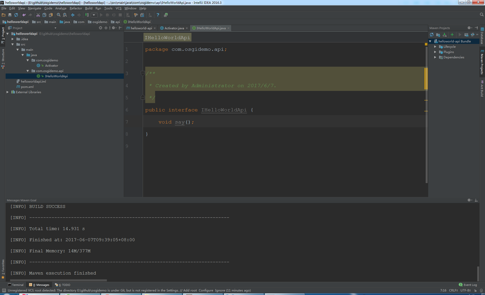
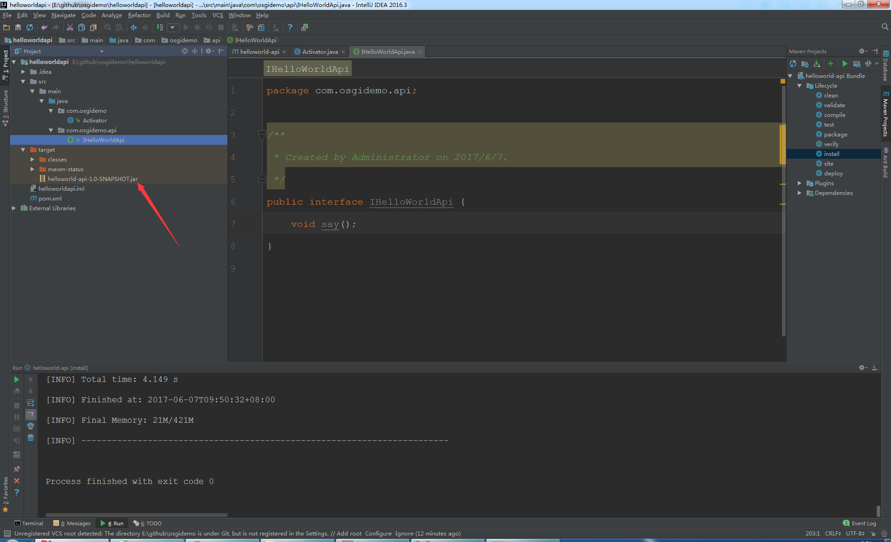
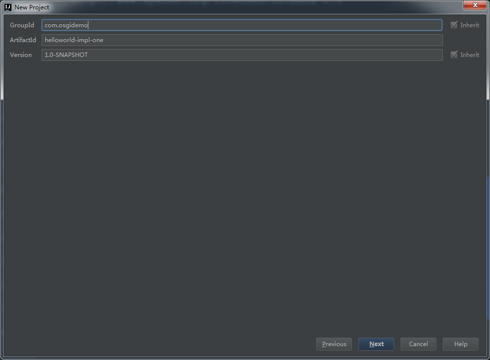
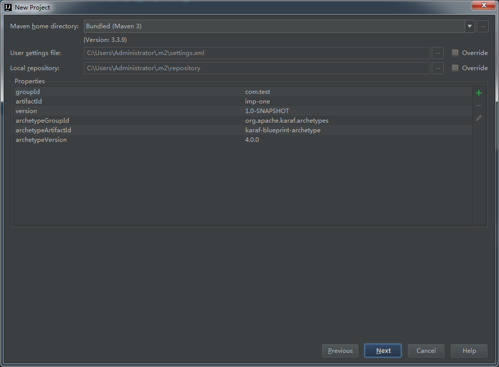

# 使用 idea 创建 OSGI 项目
> 使用 Intellij IDEA 建立 OSGI 项目示例

## 检查 Maven 项目是否已安装模板

1. 安装 kafar-blueprint-archetype
    
    GroupId：org.apache.karaf.archetypes
    ArchetypeId：karaf-blueprint-archetype
    Version：4.0.0
    点击“OK”完成安装

2. 安装 kafar-bundel-archetype
    
    GroupId：org.apache.karaf.archetypes
    ArchetypeId：karaf-bundle-archetype
    Version：4.0.0
    点击“OK”完成安装

## 建立 IHelloWord 接口项目
1. 选择 File -> Project 打开 “New Project” 窗口。
    
2. 选择 Maven 项目，选中“Create from archetype ”，使用 karaf-bundle-archetype 模板，点击“Next”。
    
3. 在 GroupId 填写 com.osgidemo，ArchetypeId 填写 helloword，点击“Next”。
    
4. 点击“Next”。
    
5. Project Name 默认为 "helloword"，点击“Finish”，新建项目完成。
    
6. 等待资源加载完成。 
    
7. 新建 Java 接口。
   点击右侧“Maven Projects”，刷新按钮，左侧项目资源管理器的 java 文件夹会变成 包命名的形式，右键选择 com.test -> New -> Java Class.
    
   弹出 “Create New Class” 窗口，Name 填写 IHelloWorld，Kind 选择 Interface，点击“OK”，完成 IHelloWorld 接口文件创建。
    
8. IHelloWorld 接口写一个 say 方法 返回值 void
    
   ```
       package com.osgitest.api;
       public interface IHelloWorld {
          void say();
       }
   ```
9. 生成 helloworld.jar 包。
   点击右侧 “Maven Projects” 窗口中 helloworld Bundle -> Lifecycl -> install
    
   左侧项目资源管理器中会出现 target 文件夹。
    

IHelloWord 项目完成 

***

## 建立 ImplOne 实现类项目
1. 选择 File -> Project 打开 “New Project” 窗口。
    
2. 选择 Maven 项目，选中“Create from archetype ”，使用 karaf-blueprint-archetype 模板，点击“Next”。
    
3. 在 GroupId 填写 com.osgidemo，ArchetypeId 填写 impl-one，点击“Next”。
    
4. 点击“Next”。
    
5. 输入项目名 "implone"，点击“Finish”，新建项目完成。
    
6. 等待资源加载完成。 
    
7. 新建 Java 类
   点击右侧“Maven Projects”，刷新按钮，左侧项目资源管理器的 java 文件夹会变成 包命名的形式，右键选择 com.test -> New -> Java Class.
    
   弹出 “Create New Class” 窗口，Name 填写 IHelloWorld，Kind 选择 Class，点击“OK”，完成 IHelloWorld 接口文件创建。
    
8. MyServiceImplOne 类继承 IHelloWorld 接口，实现 IHelloWorld 的 say 方法。
    ```
        package com.test.impl;

        import com.test.api.IHelloWorld;
        
        public class MyServiceImplOne implements IHelloWorld {        
        
            public void say() {
                System.out.println("this is impl one !!!");
            }

        }
    ```
9. 将 MyServiceImplOne 注册为服务，修改 src -> resources -> OSGI-INF.buleprint -> my-service.xml。
    ```
        <blueprint xmlns="http://www.osgi.org/xmlns/blueprint/v1.0.0">
    
            <bean id="serviceBean" class="com.test.impl.MyServiceImplOne"/>
    
            <service ref="serviceBean" interface="com.test.api.IHelloWorld"/>
    
        </blueprint>

    ```
    
10. 生成 impl-one.jar 包。
   点击右侧 “Maven Projects” 窗口中 implone Bundle -> Lifecycl -> install
    
   左侧项目资源管理器中会出现 target 文件夹。
    

ImplOne 项目完成 

***

## 建立 ImplTwo 实现类项目
1. 选择 File -> Project 打开 “New Project” 窗口。
2. 选择 Maven 项目，使用 karaf-blueprint-archetype 模板，点击“Next”。
3. 在 GroupId 填写 com.osgidemo，ArchetypeId 填写 impl-two，点击“Next”。
4. 点击“Next”。
5. 输入项目名 "impltwo"，点击“Finish”，新建项目完成。
6. 等待资源加载完成。 
7. 新建 Java 类
   点击右侧“Maven Projects”，刷新按钮，左侧项目资源管理器的 java 文件夹会变成 包命名的形式，右键选择 com.test -> New -> Java Class.
   弹出 “Create New Class” 窗口，Name 填写 IHelloWorld，Kind 选择 Class，点击“OK”，完成 IHelloWorld 接口文件创建。
8. MyServiceImplOne 类继承 IHelloWorld 接口，实现 IHelloWorld 的 say 方法。
    ```
        package com.test.impl;

        import com.test.api.IHelloWorld;
        
        public class MyServiceImplOne implements IHelloWorld {        
        
            public void say() {
                System.out.println("this is impl one !!!");
            }
            
        }
    ```
9. 将 MyServiceImplTwo 注册为服务，修改 src -> resources -> OSGI-INF.buleprint -> my-service.xml。
    ```
    <blueprint xmlns="http://www.osgi.org/xmlns/blueprint/v1.0.0">

        <bean id="serviceBean" class="com.test.impl.MyServiceImplTwo"/>

        <service ref="serviceBean" interface="com.test.api.IHelloWorld"/>

    </blueprint>
    ```
10. 生成 impl-two.jar 包。
   点击右侧 “Maven Projects” 窗口中 impltwo Bundle -> Lifecycl -> install
    
   左侧项目资源管理器中会出现 target 文件夹。
    

ImplTwo 项目完成 

***

## 建立 clinet 消费类项目
1. 选择 File -> Project 打开 “New Project” 窗口。
2. 选择 Maven 项目，使用 karaf-blueprint-archetype 模板，点击“Next”。
3. 在 GroupId 填写 com.osgidemo，ArchetypeId 填写 clinet，点击“Next”。
4. 点击“Next”。
5. 输入项目名 "cline"，点击“Finish”，新建项目完成。
6. 等待资源加载完成。 
7. 新建 Java 类
   点击右侧“Maven Projects”，刷新按钮，左侧项目资源管理器的 java 文件夹会变成 包命名的形式，右键选择 com.test -> New -> Java Class.
   弹出 “Create New Class” 窗口，Name 填写 com.osgitest.client.MyClient，Kind 选择 Class，点击“OK”，完成 MyClient 接口文件创建。
8. 完成 MyClient.java 代码。
    ```
        package com.osgitest.client;

        import com.osgitest.api.IHelloWorld;
                
        public class MyClient {
            IHelloWorld helloWorld;
        
            public void echo() {
                helloWorld.say();
            }
        
            public void setHelloWorld(IHelloWorld helloWorld) {
                this.helloWorld = helloWorld;
            }
        }
    ```
9. 将 IHelloWorld 服务接口实现的类传递给 MyClient 的 helloWorld。
    ```
    <blueprint xmlns="http://www.osgi.org/xmlns/blueprint/v1.0.0">

        <reference id="helloWorldService" interface="com.osgitest.api.IHelloWorld"></reference>

        <bean id="helloWorldClient" class="com.osgitest.client.MyClient" init-method="echo">
            <property name="helloWorld" ref="helloWorldService"/>
        </bean>

    </blueprint>    
    ```
10. 生成 helloworld.jar 包。
   点击右侧 “Maven Projects” 窗口中 helloworldclinet Bundle -> Lifecycl -> install
    
   左侧项目资源管理器中会出现 target 文件夹。
    

clinet 项目完成 

***

## 在 karaf 下测试
1. 分别将 
   hello-world-1.0-SNAPSHOT.jar，
   impl-first-1.0-SNAPSHOT.jar，
   impl-second-1.0-SNAPSHOT.jar，
   helloworld-client-1.0-SNAPSHOT.jar 拷贝到
   D:\java-develop\tools\apache-karaf\deploy。
   
2. 打开 D:\java-develop\tools\apache-karaf\bin\karaf.dat 控制台进行测试