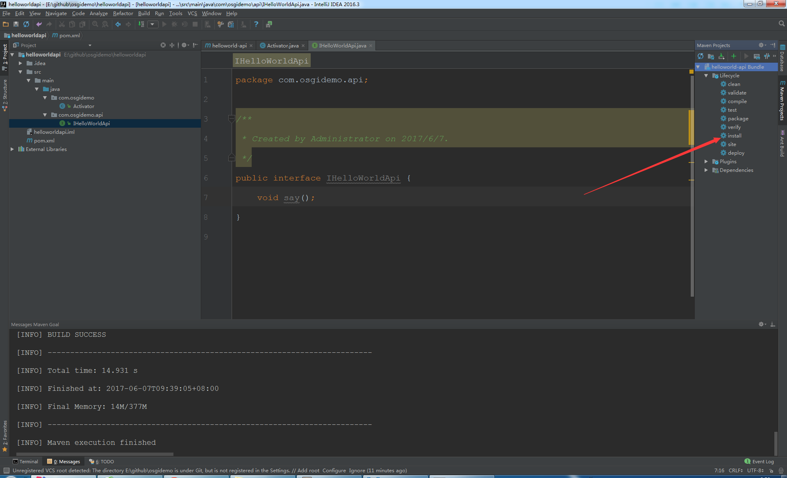
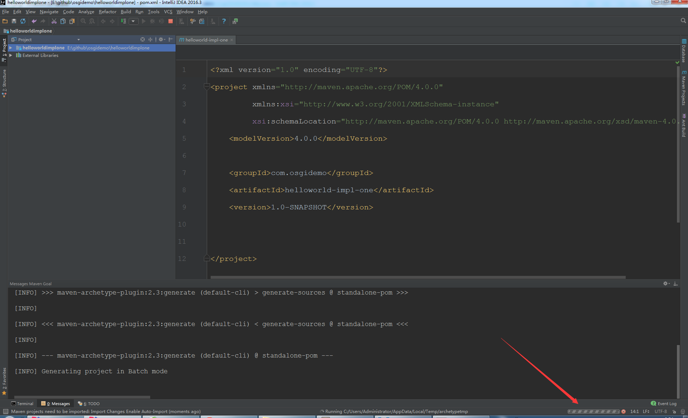

# 使用 idea 创建 OSGI 项目
> 使用 Intellij IDEA 建立 OSGI 项目示例

## 文件介绍
    apache-karaf：karaf 文件
    helloworldapi：IHelloWorldApi 项目文件
    helloworldclinet：IHelloWorldClinet 项目文件
    helloworldimplone：IHelloWorldImplOne 项目文件
    helloworldimpltwo：IHelloWorldImplTop 项目文件
    Pictures：README.md 文件图片文件夹

## 操作步骤

### 检查 Maven 项目是否已安装模板

1. 安装 kafar-blueprint-archetype
    
    GroupId：org.apache.karaf.archetypes
    ArchetypeId：karaf-blueprint-archetype
    Version：4.0.0
    点击“OK”完成安装

2. 安装 kafar-bundel-archetype
    
    GroupId：org.apache.karaf.archetypes
    ArchetypeId：karaf-bundle-archetype
    Version：4.0.0
    点击“OK”完成安装

### 建立 IHelloWorldApi 接口项目
1. 选择 File -> Project 打开 “New Project” 窗口。
    
2. 选择 Maven 项目，选中“Create from archetype ”，使用 karaf-bundle-archetype 模板，点击“Next”。
    
3. 在 GroupId 填写 com.osgidemo，ArchetypeId 填写 helloworldapi，Version 默认 1.0-SNAPSHOT，点击“Next”。
    
4. 点击“Next”。
    
5. Project Name 默认为 "helloword"，点击“Finish”，新建项目完成。
    
6. 等待资源加载完成。 
    
7. 新建 Java 接口。
   点击右侧“Maven Projects”，刷新按钮，左侧项目资源管理器的 java 文件夹会变成 包命名的形式，右键选择 com.test -> New -> Java Class.
    
   弹出 “Create New Class” 窗口，Name 填写 com.osgidemo.api.IHelloWorldApi，Kind 选择 Interface，点击“OK”，完成 IHelloWorldApi 接口文件创建。
    
8. IHelloWorldApi 接口写一个 say 方法 返回值 void
    
   ```
       package com.osgidemo.api;
       public interface IHelloWorldApi {
          void say();
       }
   ```
9. 生成 helloworld.jar 包。
   点击右侧 “Maven Projects” 窗口中 helloworld Bundle -> Lifecycl -> install
    
   左侧项目资源管理器中会出现 target 文件夹。
    

IHelloWord 项目完成 

***

### 建立 HelloWorldImplOne 实现类项目
1. 选择 File -> Project 打开 “New Project” 窗口。
    
2. 选择 Maven 项目，选中“Create from archetype ”，使用 karaf-blueprint-archetype 模板，点击“Next”。
    
3. 在 GroupId 填写 com.osgidemo，ArchetypeId 填写 helloworld-impl-one，点击“Next”。
    
4. 点击“Next”。
    
5. 输入项目名 "implone"，点击“Finish”，新建项目完成。
    
6. 等待资源加载完成。 
    
7. 修改 pom.xml 文件，项目资源管理器 helloworldimplone -> pom.xml。
    
    在 description 标签下 插入
    ```
        <dependencies>
            <dependency>
                <groupId>com.osgidemo</groupId>
                <artifactId>helloworld-api</artifactId>
                <version>1.0-SNAPSHOT</version>
            </dependency>
        </dependencies>
    ```
    刷新右侧 Maven Projects 会出现 Dependencies 文件夹

8. 新建 Java 类
   点击右侧“Maven Projects”，刷新按钮，左侧项目资源管理器的 java 文件夹会变成 包命名的形式，右键选择 com.test -> New -> Java Class.
    
   弹出 “Create New Class” 窗口，Name 填写 com.osgidemo.impl.HelloWorldImplOne，Kind 选择 Class，点击“OK”，完成 IHelloWorldApi 接口文件创建。
    

9. HelloWorldImplOne 类继承 IHelloWorldApi 接口，实现 IHelloWorldApi 的 say 方法。
    
    ```
        package com.osgidemo.impl;

        import com.osgidemo.api.IHelloWorldApi;

        public class HelloWorldImplOne implements IHelloWorldApi {
            public void say() {
                System.out.println("this is HelloWorldImplOne !!!");
            }
        }

    ```

10. 将 HelloWorldImplOne 注册为服务，修改 src -> resources -> OSGI-INF.buleprint -> my-service.xml。
    
    ```
        <blueprint xmlns="http://www.osgi.org/xmlns/blueprint/v1.0.0" default-activation="lazy">

            <bean id="serviceBean" class="com.osgidemo.impl.HelloWorldImplOne"/>

            <service ref="serviceBean" interface="com.osgidemo.api.IHelloWorldApi"/>

        </blueprint>

    ```
    
10. 生成 helloworld-impl-one.jar 包。
   点击右侧 “Maven Projects” 窗口中 implone Bundle -> Lifecycl -> install
   左侧项目资源管理器中会出现 target 文件夹。
    

ImplOne 项目完成 

***

### 建立 HelloWorldImplTwo 实现类项目
1. 选择 File -> Project 打开 “New Project” 窗口。
    
2. 选择 Maven 项目，使用 karaf-blueprint-archetype 模板，点击“Next”。
    
3. 在 GroupId 填写 com.osgidemo，ArchetypeId 填写 helloworld-impl-two，点击“Next”。
    
4. 点击“Next”。
    
5. 输入项目名 "impltwo"，点击“Finish”，新建项目完成。
    
6. 等待资源加载完成。 
    
7. 修改 pom.xml 文件，项目资源管理器 helloworldimpltwo -> pom.xml。
    
    在 description 标签下 插入
    ```
        <dependencies>
            <dependency>
                <groupId>com.osgidemo</groupId>
                <artifactId>helloworld-api</artifactId>
                <version>1.0-SNAPSHOT</version>
            </dependency>
        </dependencies>
    ```
    刷新右侧 Maven Projects 会出现 Dependencies 文件夹

8. 新建 Java 类
   点击右侧“Maven Projects”，刷新按钮，左侧项目资源管理器的 java 文件夹会变成 包命名的形式，右键选择 com.test -> New -> Java Class.
    
   弹出 “Create New Class” 窗口，Name 填写 IHelloWorldApi，Kind 选择 Class，点击“OK”，完成 IHelloWorldApi 接口文件创建。
    
9. HelloWorldImplOne 类继承 IHelloWorldApi 接口，实现 IHelloWorldApi 的 say 方法。
    
    ```
        package com.osgidemo.impl;

        import com.osgidemo.api.IHelloWorldApi;
                
        public class HelloWorldImplTwo implements IHelloWorldApi {
            public void say() {
                System.out.println("this is HelloWorldImplTwo !!!");
            }
        }
    ```
10. 将 HelloWorldImplTwo 注册为服务，修改 src -> resources -> OSGI-INF.buleprint -> my-service.xml。
    
    ```
        <blueprint xmlns="http://www.osgi.org/xmlns/blueprint/v1.0.0">

            <bean id="serviceBean" class="com.osgidemo.impl.HelloWorldImplTwo"/>

            <service ref="serviceBean" interface="com.osgidemo.api.IHelloWorldApi"/>

        </blueprint>
    ```
11. 生成 impl-two.jar 包。
   点击右侧 “Maven Projects” 窗口中 impltwo Bundle -> Lifecycl -> install
   左侧项目资源管理器中会出现 target 文件夹。
    

ImplTwo 项目完成 

***

### 建立 HelloWorldClient 消费类项目
1. 选择 File -> Project 打开 “New Project” 窗口。
    
2. 选择 Maven 项目，使用 karaf-blueprint-archetype 模板，点击“Next”。
    
3. 在 GroupId 填写 com.osgidemo，ArchetypeId 填写 helloworld-clinet，点击“Next”。
    
4. 点击“Next”。
    
5. 输入项目名 "cline"，点击“Finish”，新建项目完成。
    
6. 等待资源加载完成。 
    
7. 修改 pom.xml 文件，项目资源管理器 helloworldclinet -> pom.xml。
    
    在 description 标签下 插入
    ```
        <dependencies>
            <dependency>
                <groupId>com.osgidemo</groupId>
                <artifactId>helloworld-api</artifactId>
                <version>1.0-SNAPSHOT</version>
            </dependency>
        </dependencies>
    ```
    刷新右侧 Maven Projects 会出现 Dependencies 文件夹
8. 新建 Java 类
   点击右侧“Maven Projects”，刷新按钮，左侧项目资源管理器的 java 文件夹会变成 包命名的形式，右键选择 com.test -> New -> Java Class.
    
   弹出 “Create New Class” 窗口，Name 填写 com.osgitest.client.HelloWorldClient，Kind 选择 Class，点击“OK”，完成 HelloWorldClient 接口文件创建。
    
9. 完成 HelloWorldClient.java 代码。
    
    ```
        package com.osgidemo.client;

        import com.osgidemo.api.IHelloWorldApi;

        public class HelloWorldClient  {
            IHelloWorldApi iHelloWorldApi;
            public void echo(){
                iHelloWorldApi.say();
            }
            public void setiHelloWorldApi(IHelloWorldApi iHelloWorldApi){
                this.iHelloWorldApi = iHelloWorldApi;
            }
        }

    ```
10. 将 IHelloWorldApi 服务接口实现的类传递给 HelloWorldClient 的 helloWorld。
    
    ```
    <blueprint xmlns="http://www.osgi.org/xmlns/blueprint/v1.0.0">

        <reference id="helloWorldService" interface="com.osgidemo.api.IHelloWorldApi"></reference>

        <bean id="serviceBean" class="com.osgidemo.client.HelloWorldClient"  init-method="echo">
            <property name="iHelloWorldApi" ref="helloWorldService"/>
        </bean>

    </blueprint>  
    ```
11. 生成 helloworld.jar 包。
   点击右侧 “Maven Projects” 窗口中 helloworldclinet Bundle -> Lifecycl -> install
   左侧项目资源管理器中会出现 target 文件夹。
    

clinet 项目完成 

***

### 在 karaf 下测试
1. 分别将 
   helloworld-api-1.0-SNAPSHOT.jar，
   helloworld-clinet-1.0-SNAPSHOT.jar，
   helloworld-impl-one-1.0-SNAPSHOT.jar，
   helloworld-impl-two-1.0-SNAPSHOT.jar 拷贝到
   D:\java-develop\tools\apache-karaf\deploy。

2. 打开 D:\java-develop\tools\apache-karaf\bin\karaf.dat 控制台进行测试