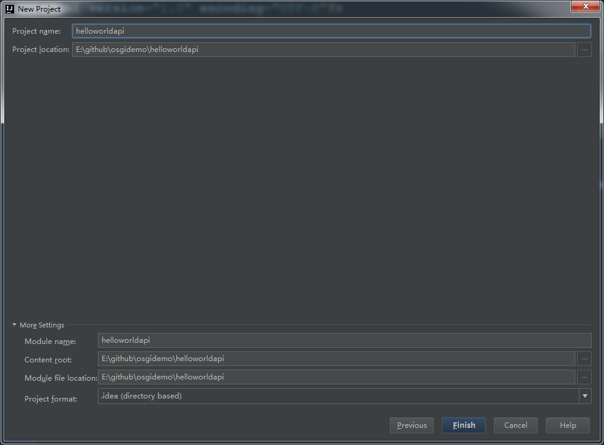

# 使用 idea 创建 OSGI 项目
使用 Intellij IDEA 建立 OSGI 项目示例

## 检查 Maven 项目是否已安装模板

1. 安装 kafar-blueprint-archetype
    
    GroupId：org.apache.karaf.archetypes
    ArchetypeId：karaf-blueprint-archetype
    Version：4.0.0
    点击“OK”完成安装

2. 安装 kafar-bundel-archetype
    
    GroupId：org.apache.karaf.archetypes
    ArchetypeId：karaf-bundle-archetype
    Version：4.0.0
    点击“OK”完成安装

## 建立 IHelloWord 接口项目
1. 选择 File -> Project 打开 “New Project” 窗口。
    
2. 选择 Maven 项目，选中“Create from archetype ”，使用 karaf-bundle-archetype 模板，点击“Next”。
    
3. 在 GroupId 填写 com.osgidemo，ArchetypeId 填写 helloword，点击“Next”。
    
4. 点击“Next”。
    
5. Project Name 默认为 "helloword"，点击“Finish”，新建项目完成。
    

## 建立 ImplOne 实现类项目
1. 选择 File -> Project 打开 “New Project” 窗口。
2. 选择 Maven 项目，使用 karaf-blueprint-archetype 模板，点击“Next”。
3. 在 GroupId 填写 com.osgidemo，ArchetypeId 填写 impl-one，点击“Next”。
4. 点击“Next”。
5. 输入项目名 "implone"，点击“Finish”，新建项目完成。

## 建立 ImplTwo 实现类项目
1. 选择 File -> Project 打开 “New Project” 窗口。
2. 选择 Maven 项目，使用 karaf-blueprint-archetype 模板，点击“Next”。
3. 在 GroupId 填写 com.osgidemo，ArchetypeId 填写 impl-two，点击“Next”。
4. 点击“Next”。
5. 输入项目名 "impltwo"，点击“Finish”，新建项目完成。

## 建立 cline 消费类项目
1. 选择 File -> Project 打开 “New Project” 窗口。
2. 选择 Maven 项目，使用 karaf-blueprint-archetype 模板，点击“Next”。
3. 在 GroupId 填写 com.osgidemo，ArchetypeId 填写 cline，点击“Next”。
4. 点击“Next”。
5. 输入项目名 "cline"，点击“Finish”，新建项目完成。

